  

  

  
  
  
  
  
  
  
  

---

Founder & Principal Engineer at **Alien Build Tech**. Software Engineer & Cloud/DevOps Specialist with extensive experience across Microsoft Azure, AWS, Kubernetes, and automated GitOps CI/CD pipelines.

## About

I lead Alien Build Tech, focusing on cloud architecture, infrastructure automation, and Site Reliability Engineering (SRE). Most of what I build sits in the resilient infrastructure layer: scalable Kubernetes clusters, automated GitOps delivery pipelines, cloud governance, and developer self-service tooling.

Extensive experience in Azure Cloud using AKS, ACI, Azure Functions, Logic Apps, and Infrastructure as Code (Bicep / ARM / PowerShell).

## Currently working on

- **Cloud Platform Automation & GitOps.** Designing resilient cluster topologies and automated deployment workflows with ArgoCD and Kubernetes.
- **Enterprise Azure CI/CD.** Standardizing reusable pipeline templates and governance automation with Azure DevOps (AZDOPS) and GitHub Actions.
- **AI Infrastructure.** Deploying secure enterprise generative AI architectures and OpenAI endpoints with private networking.

## Selected work

**[AZDOPS](https://github.com/Johnnie88/AZDOPS)**
PowerShell automation modules and functions for managing Azure DevOps organizations, project configurations, service connections, and pipelines.

**[argocd-clickhouse](https://github.com/Johnnie88/argocd-clickhouse)**
Automated GitOps deployment and cluster operations for ClickHouse analytical databases running on Kubernetes orchestrated with ArgoCD.

**[AzOps-Accelerator](https://github.com/Johnnie88/AzOps-Accelerator)**
Integrated CI/CD and deployment solution for Microsoft Azure enterprise landing zones, infrastructure-as-code templates, and governance.

**[alien-build-tui](https://github.com/Johnnie88/alien-build-tui)**
Terminal User Interface (TUI) utility developed at Alien Build Tech for streamlining local builds and command execution workflows.

**[azurechatgpt](https://github.com/Johnnie88/azurechatgpt)**
Private, enterprise-ready, and secure ChatGPT implementation running on Azure OpenAI and Azure App Services.

**[azure-pipeline-templates](https://github.com/Johnnie88/azure-pipeline-templates)**
Reusable, standardized pipeline templates and quality gates for Azure Pipelines CI/CD workflows.

**[Repo-Analysis-Tool](https://github.com/Johnnie88/Repo-Analysis-Tool)**
Automated codebase inspection and repository analysis tool for auditing structure, dependencies, and code health.

## What I reach for

| Layer | Usually |
| --- | --- |
| Cloud & Infrastructure | Azure (AKS, Functions, ACI), AWS |
| Containers & GitOps | Kubernetes, Docker, ArgoCD, Helm |
| Automation & CI/CD | GitHub Actions, Azure DevOps (AZDOPS), PowerShell, Bash |
| Languages | PowerShell, Python, TypeScript, C#, Shell |
| Daily driver | Linux, Git, Neovim / VS Code, tmux |

## How I work

- Small, reproducible, automated changes. Systems should be resilient, declarative, and easily audited.
- Instrument before optimizing. If performance and telemetry are not measurable in logs and metrics, issues stay hidden until outages occur.
- Automate operations through code. Prefer GitOps workflows and infrastructure-as-code over manual console steps.

## 📊 Activity

  
  

  

  

## Contact

- GitHub — [github.com/Johnnie88](https://github.com/Johnnie88)
- daily.dev — [app.daily.dev/johnnie88](https://app.daily.dev/johnnie88)

---

Code in these repositories is open source unless stated otherwise.
